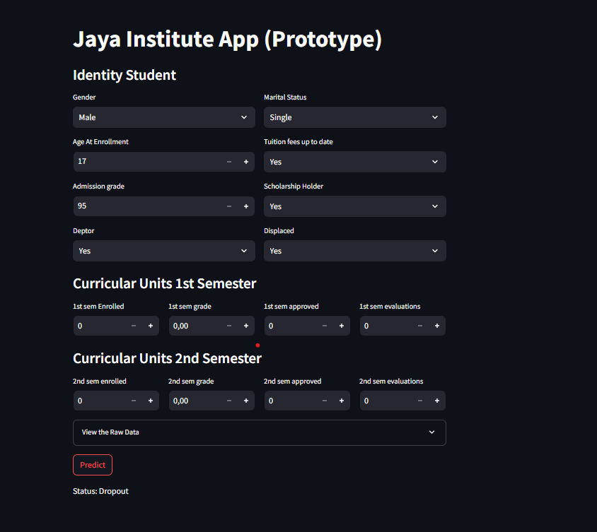

# Proyek Akhir: Menyelesaikan Permasalahan Perusahaan Edutech

## Business Understanding

Jaya Jaya Institut merupakan salah satu institusi pendidikan perguruan yang telah berdiri sejak tahun 2000. Hingga saat ini ia telah mencetak banyak lulusan dengan reputasi yang sangat baik. Akan tetapi, terdapat banyak juga siswa yang tidak menyelesaikan pendidikannya alias dropout.

Jumlah dropout yang tinggi ini tentunya menjadi salah satu masalah yang besar untuk sebuah institusi pendidikan. Oleh karena itu, Jaya Jaya Institut ingin mendeteksi secepat mungkin siswa yang mungkin akan melakukan dropout sehingga dapat diberi bimbingan khusus.

Sebagai respons terhadap kondisi tersebut, pihak perguruan menyadari pentingnya pemantauan dan analisis mendalam terhadap berbagai faktor yang mempengaruhi keputusan siswa droput dari perguruan. Oleh karena itu perlu identifikasi faktor-faktor penyebab droput dan mengembangkan business dashboard sebagai alat bantu visual untuk memantau tren dan indikator penting terkait karyawan, demi mendukung pengambilan keputusan yang lebih efektif dan berbasis data.

### Permasalahan Bisnis

Jaya Jaya Institut menghadapi permasalahan serius terkait tingginya angka mahasiswa yang tidak menyelesaikan pendidikan alias dropout. Permasalahan ini tidak hanya berdampak pada aspek akademik, tetapi juga pada aspek bisnis dan reputasi institusi secara keseluruhan. Beberapa dampak yang ditimbulkan antara lain:

- Penurunan citra dan reputasi institusi di mata masyarakat dan calon mahasiswa.
- Ketidakefisienan dalam penggunaan sumber daya pendidikan seperti tenaga pengajar, fasilitas, dan dana operasional.
- Potensi penurunan akreditasi program studi akibat rendahnya tingkat kelulusan.
- Berkurangnya pemasukan institusi dari biaya pendidikan mahasiswa yang dropout di tengah jalan.

### Cakupan Proyek

1. Data Understanding

   Mengumpulkan dan mempelajari data karyawan yang relevan untuk memahami struktur, sumber, dan potensi permasalahan kualitas data. Tahap ini bertujuan membangun pemahaman komprehensif mengenai konteks data yang akan dianalisis.

2. Data Preparation

   Pada tahap data preparation, dilakukan serangkaian proses untuk mempersiapkan data agar dapat diproses oleh model secara optimal. Proses ini meliputi:

   - Penghapusan fitur yang kurang relevan atau tidak berkontribusi signifikan terhadap analisis,

   - Pembagian data (data splitting) menjadi data latih (training set) dan data uji (testing set) untuk keperluan pelatihan dan evaluasi model.

3. Modelling

   Pada tahap modeling, dilakukan pelatihan model menggunakan algoritma Random Forest dengan memanfaatkan data training yang telah dipersiapkan sebelumnya. Random Forest dipilih karena merupakan algoritma ensemble yang kuat dan andal dalam menangani data dengan banyak fitur, baik numerik maupun kategorikal. Selain itu, algoritma ini memiliki kemampuan yang baik dalam mengatasi overfitting, memberikan hasil yang stabil dan akurat, serta dapat menangani data yang tidak terdistribusi secara linier.

4. Evaluasi

   Menganalisis performa model menggunakan data pengujian dengan berbagai metrik evaluasi seperti accuracy, precision, recall, dan F1-score, untuk melihat performa model yang telah di latih.

5. Pembuatan inference testing menggunakan streamlit

   Setelah model machine learning selesai dilatih untuk memprediksi kemungkinan dropout mahasiswa, langkah berikutnya adalah membangun antarmuka yang memungkinkan pengguna (misalnya dosen wali, pihak akademik, atau manajemen kampus) melakukan inference testing.

6. Pengembangan Dashboard

   Merancang dan mengembangkan dashboard yang memudahkan pihak perguruan tinggi untuk mengawasi indikator penting terkait faktor risiko utama

7. Dokumentasi Laporan dan Rekomendasi

   Mendokumentasikan seluruh tahapan proyek, dari analisis hingga implementasi. Menyajikan temuan utama dan memberikan saran berbasis data yang dapat diterapkan oleh perguruan tinggi untuk mengurangi tingkat dropout.

### Persiapan

Sumber data: [Dataset Students' Performance](https://github.com/dicodingacademy/dicoding_dataset/tree/main/students_performance)

1. Clone repository ini ke komputer lokal Anda menggunakan perintah berikut:

   ```shell
   https://github.com/muhammadRizki12/students-performance
   ```

2. Setup conda environment:

   ```
   conda create --name main-ds python=3.9
   conda activate main-ds
   pip install -r requirements.txt
   ```

3. Install requirements:

   ```
   pip install -r requirements.txt
   ```

4. Setup database (supabase):

   - Buat akun dan login https://supabase.com/dashboard/sign-in.
   - Klik new project
   - Copy URI pada database setting
   - Kirim dataset menggunakan sqlalchemy

   ```
    from sqlalchemy import create_engine
    URL = "DATABASE_URL"
    engine = create_engine(URL)
    dataset.to_sql('dataset', engine)
   ```

5. Setup metabase:
   ```
   docker pull metabase/metabase:v0.46.4
   docker run -p 3000:3000 --name metabase metabase/metabase
   ```
   Akses metabase pada http://localhost:3000/setup dan lakukan setup.

## Business Dashboard

Dashboard ini dibuat untuk memvisualisasikan data terkait siswa dan tingkat droput siswa. Tujuan utama dashboard adalah untuk membantu perguruan dalam memantau, menganalisis, dan memahami faktor-faktor yang memengaruhi tingginya droput, serta mendukung pengambilan keputusan strategis oleh tim perguruan.

<!--  -->

<!--  -->

<!--  -->

## Menjalankan Sistem Machine Learning

- Buka terminal dan navigasikan ke direktori tempat berkas app.py berada.
- Jalankan aplikasi dengan perintah berikut:

```
streamlit run app.py
```

- Setelah menjalankan perintah tersebut, aplikasi akan terbuka di browser Anda secara otomatis. Jika tidak, Anda dapat mengaksesnya melalui alamat http://localhost:8501.

* Atau mengakses link berikut: https://muhammadrizki12-students-performance-app-1jomo0.streamlit.app/

<!--  -->

## Conclusion

1. Tingkat Dropout Masih Tinggi

   Dari total 3.630 mahasiswa, sebanyak 1.421 mahasiswa (39,15%) tercatat mengalami dropout, merupakan sebuah angka yang signifikan dan memerlukan perhatian khusus.

2. Biaya Pendidikan (Tuition Fees)

   mahasiswa yang tidak membayar biaya kuliah tepat waktu (tuition = 0) memiliki angka dropout yang sangat tinggi (486 dari 943, atau sekitar 51,5%).

3. Debitur (Hutang)

   Student dengan status memiliki hutang (debtor = 1) semuanya mengalami dropout (413 siswa). Ini menunjukkan bahwa masalah finansial berperan penting dalam keputusan untuk keluar dari studi.

4. Nilai dan Evaluasi Semester Awal

   Mahasiswa yang dropout cenderung memiliki:

   - Nilai semester 1 dan 2 lebih rendah
   - Jumlah mata kuliah yang disetujui (approved) lebih sedikit
   - Evaluasi yang rendah

   Ini mengindikasikan bahwa performansi akademik pada awal studi menjadi prediktor utama untuk potensi dropout.

5. Status Pernikahan dan Gender

   Sebagian besar mahasiswa adalah perempuan (66%) dan single (88.1%), tetapi rasio dropout tidak terlalu bervariasi berdasarkan gender maupun status pernikahan.

6. Usia Saat Mendaftar

   Sebagian besar mahasiswa mendaftar pada usia 18–22 tahun, dan pada kelompok ini juga terdapat kasus dropout paling banyak

7. Pemegang Beasiswa (Scholarship Holder)

   Mahasiswa tanpa beasiswa memiliki dropout lebih tinggi dibandingkan yang mendapat beasiswa, namun perbedaan tidak terlalu drastis.

### Rekomendasi Action Items

- Program Bimbingan dan Intervensi Dini

  Buat program mentoring khusus bagi mahasiswa yang terdeteksi berisiko tinggi. Tugaskan dosen wali untuk melakukan pendekatan personal terhadap mahasiswa bermasalah.

- Bantuan Keuangan dan Relaksasi Pembayaran

  Tinjau kembali skema beasiswa dan perluas cakupannya, khususnya untuk mahasiswa yang menunjukkan motivasi belajar tapi mengalami kesulitan finansial.

- Optimalisasi Proses Akademik Semester Awal

  Evaluasi ulang beban dan struktur mata kuliah semester 1 dan 2 agar tidak terlalu memberatkan mahasiswa baru. Adakan kelas remedial dan pelatihan belajar efektif untuk mahasiswa baru.

- Adakan survei kepuasan dan kesulitan belajar

  Hal ini penting karena untuk menggali umpan balik dari mahasiswa tentang Pengalaman belajar mereka selama perkuliahan, Tingkat kesulitan yang mereka hadapi, Kepuasan terhadap metode pengajaran, dosen, fasilitas, dan layanan kampus.

## Email dan password Metabase

- Email: root@mail.com
- Password: root123
